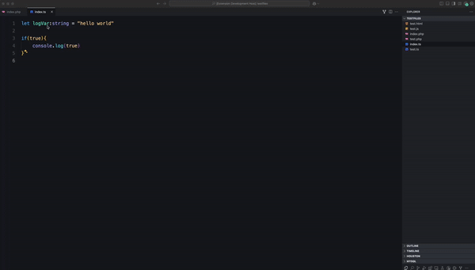

# PolyLog

**PolyLog** is a VS Code extension that automatically detects the programming language and inserts the appropriate log statement for selected variables. Whether you’re working in JavaScript, TypeScript, PHP, or a mix within HTML, PolyLog simplifies debugging by adding language-specific log statements with a single click.



## Features

- **Automatic Language Detection**: Detects the file type based on its extension and determines the appropriate log statement for the language.
- **Flexible Log Placement**: Works seamlessly within `<script>` tags in HTML and PHP files, inserting JavaScript log statements inside embedded scripts.
- **Language-Specific Logging**: Automatically adds:
  - `console.error` statements for JavaScript and TypeScript files, with custom styling for enhanced readability.
  - `echo` statements for PHP files.

## Supported Languages

- JavaScript
- TypeScript
- PHP

## Usage

1. **Select a Variable**: Highlight the variable you wish to log in your code. PolyLog will detect the variable and add a log statement for it only.
2. **Insert Log Statement**: Use the command palette or keyboard shortcut to insert the log statement:
   - Open the Command Palette with `Cmd+Shift+P` (Mac) or `Ctrl+Shift+P` (Windows) and select **PolyLog: Add Log**.
   - Alternatively, use `Cmd+Shift+A` (Mac) or `Ctrl+Shift+A` (Windows) for a quick shortcut to add the log.

### Examples

1. **In a JavaScript or TypeScript file**:
   - Select a variable (e.g., `logStr`), and PolyLog will insert:
     ```javascript
     console.error('%c[Log #1730658846430] logStr:', 'color: red; font-weight: bold;', logStr);
     ```

2. **In a PHP file**:
   - Select a variable (e.g., `$aarrrr`), and PolyLog will insert:
     ```php
     echo '[Log #1730657218477] $aarrrr: ', $aarrrr;
     ```

3. **Within `<script>` tags in HTML or PHP files**:
   - When working in mixed environments like HTML or PHP files, PolyLog will insert JavaScript’s `console.error` for variables within `<script>` tags.

## Configuration

No additional configuration is required. PolyLog automatically detects the language and file type, so you can start logging variables immediately!
